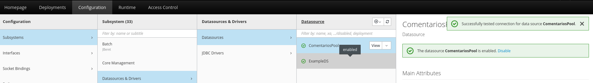

# Configuración de WildFly + PostgreSQL

Este documento describe cómo configurar un **datasource PostgreSQL** en **WildFly 27** usando el módulo JDBC y conexión externa. Es parte del proyecto *Social Batch Analyzer*.

---

## Requisitos previos

- WildFly instalado (`/opt/wildfly`)
- PostgreSQL en otro servidor o local
- Acceso root o sudo
- Archivo `.jar` del driver JDBC de PostgreSQL (versión 42.x)

---

## 1. Descargar el driver JDBC de PostgreSQL

```bash
mkdir -p /opt/wildfly/modules/system/layers/base/org/postgresql/main
cd /opt/wildfly/modules/system/layers/base/org/postgresql/main
curl -o postgresql-42.6.0.jar https://jdbc.postgresql.org/download/postgresql-42.6.0.jar
```
## 2. Crear el módulo JDBC en WildFly
Crear archivo module.xml en la misma carpeta:

```xml
<module xmlns="urn:jboss:module:1.1" name="org.postgresql">
    <resources>
        <resource-root path="postgresql-42.6.0.jar"/>
    </resources>
    <dependencies>
        <module name="javax.api"/>
        <module name="javax.transaction.api"/>
    </dependencies>
</module>
``` 

## 3. Configurar el datasource en standalone.xml

Archivo: /opt/wildfly/standalone/configuration/standalone.xml
Dentro del bloque <subsystem xmlns="urn:jboss:domain:datasources:7.2">
```xml
<datasources>
    <datasource jndi-name="java:/jdbc/ComentariosDS"
                pool-name="ComentariosPool"
                enabled="true"
                use-java-context="true">
        <connection-url>jdbc:postgresql://<IP_DEL_SERVIDOR>:5432/<NOMBRE_BASE_DATOS></connection-url>
        <driver>postgresql</driver>
        <security user-name="usuario" password="contraseña"/>
    </datasource>

    <drivers>
        <driver name="postgresql" module="org.postgresql">
            <xa-datasource-class>org.postgresql.xa.PGXADataSource</xa-datasource-class>
        </driver>
    </drivers>
</datasources>
``` 
Importante: Sustituye <IP_DEL_SERVIDOR>, <NOMBRE_BASE_DATOS>, usuario, contraseña por los valores reales.

## 4. Reiniciar WildFly

```bash
/opt/wildfly/bin/standalone.sh
```

## 5. Configurar el datasource en standalone.xml
### 1. Ir a: http://<IP-servidor>:9990
### 2. Iniciar sesión con usuario administrador
### 3. Navegar a: Configuration → Subsystems → Datasources
### 4. Seleccionar el nombre de tu data source
### 5. Hacer clic en Test Connection

Si es correcto, verás:
Successfully tested connection for data source (el nombre de tu data source) 

### Ejemplo de prueba de conexión exitosa



